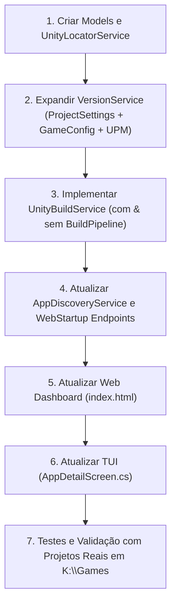

# Implementation Plan - Suporte Completo a Projetos Unity no MAUI Forge

Adicionar suporte nativo de primeira classe a projetos **Unity** no MAUI Forge, permitindo gerenciar versões (com bump sincronizado entre `ProjectSettings.asset` e `GameConfig.asset`), executar builds headless com streaming em tempo real via SignalR (tanto para projetos que utilizam o **`com.wagenheimer.buildpipeline`** quanto para projetos Unity padrão sem o pipeline), lançar jogos pós-build no Windows ou dispositivos Android via ADB, e abrir projetos diretamente no Unity Editor correspondente.

---

## 1. Cenário Atual vs. Estado Alvo

| Recurso | Estado Atual | Estado Alvo (Unity Studio Suite) |
|---|---|---|
| **Detecção de Projetos** | Detecta `ProjectSettings.asset`, mas trata como projeto genérico com apenas `bundleVersion` básico. | Detecta versão do Unity (`ProjectVersion.txt`), presença do `com.wagenheimer.buildpipeline`, perfis de publisher (`ProjectBuildConfig.asset`) e ícones de jogos. |
| **Gestão de Versão** | Regex básico que atualiza apenas `bundleVersion` e `AndroidBundleVersionCode` no `ProjectSettings.asset`. | Suporte completo a SemVer (+Patch, +Minor, +Major), atualização de `AndroidBundleVersionCode`, `buildNumber` (iPhone, Standalone) e atualização simultânea de `GameConfig.asset` (GameVersion e VersionDate dia/mês/ano). Suporte também a `package.json` para pacotes UPM. |
| **Execução de Build** | `BuildService` restrito a comandos `dotnet build/publish`. Falha em projetos Unity por exigir `.csproj`. | `UnityBuildService` com suporte a execução headless via `Unity.exe -batchmode -quit -logFile -`: <br>• **Com BuildPipeline**: `-executeMethod Wagenheimer.BuildPipeline.Editor.BuildCLI.Build` (com `-publisher`, `-platform`, `-cheat`, etc.) e `BuildMatrix`.<br>• **Sem BuildPipeline**: Builds diretos (`-buildWindows64Player`, etc.) e runners de plataforma. |
| **Localização do Editor** | Inexistente. | `UnityLocatorService`: descobre editores instalados em `C:\Program Files\Unity\Hub\Editor` (Windows), macOS e Linux; mapeia a versão do projeto para o executável exato ou o mais compatível. |
| **Pós-Build (Run)** | Apenas apps .NET MAUI. | Para Windows: inicia o `.exe` gerado. Para Android: instala o `.apk` gerado via `adb install` e executa no dispositivo conectado. |
| **Web Dashboard** | Badge estática de texto "Unity" sem ações específicas. | Card com badges da versão do Unity + `BuildPipeline`, botão "Open in Unity Editor", e Modal de Build customizado para Unity (seleção de plataforma, perfil/publisher, cheat mode, dev build, run after build). |
| **TUI (Spectre.Console)** | Assume estrutura MAUI/csproj, quebrando menus de build. | Menu contextual dedicado a projetos Unity: Bump de versão, Build com Pipeline, Build Player padrão, Abrir no Unity Editor, Git/AI commit. |

---

## 2. Detalhes dos Componentes e Arquivos

### A. Novos Modelos (`src/MauiForge/Models/`)
1. **`UnityProjectInfo.cs`**:
   - `string? EditorVersion`: Versão do Unity (ex: `6000.2.6f2`).
   - `string? EditorPath`: Caminho absoluto do `Unity.exe` correspondente.
   - `bool HasBuildPipeline`: Indica se `com.wagenheimer.buildpipeline` está no `manifest.json`.
   - `string? BuildPipelineVersion`: Versão do pipeline (ex: `v1.28.1`).
   - `List<UnityPublisherProfileInfo> Profiles`: Perfis de publisher encontrados em `ProjectBuildConfig.asset` (ex: `GreenSauceGames`, `Steam`, `GooglePlay`).
   - `bool IsPackage`: Identifica se o diretório é um pacote UPM (`package.json`).
2. **Atualização em `AppEntry.cs`**:
   - Adicionar campo opcional `UnityProjectInfo? UnityInfo = null`.
3. **Atualização em `AppVersions.cs`**:
   - Ajustar propriedades para mapear com clareza versões Desktop/Standalone, Android e iOS no contexto de jogos Unity.

---

### B. Novos Serviços & Modificações em Serviços (`src/MauiForge/Services/`)

1. **`UnityLocatorService.cs` (Novo)**:
   - Escaneia `C:\Program Files\Unity\Hub\Editor\*` (Windows), `/Applications/Unity/Hub/Editor/*` (macOS), `/opt/unity/hub/editor/*` (Linux).
   - Lê `ProjectSettings/ProjectVersion.txt` (`m_EditorVersion`).
   - Seleciona o editor com a versão exata ou a versão mais próxima instalada.
   - Fornece método `OpenProjectInEditor(string projectDir, string? unityVersion = null)` para abrir o projeto no Unity com um clique.

2. **`UnityBuildService.cs` (Novo)**:
   - Gerencia a execução de processos Unity de forma assíncrona com streaming linha a linha via `_hubContext.Clients.All.SendAsync("BuildLogLine", ...)`.
   - **Projetos com `UnityBuildPipeline`**:
     - Constrói a linha de comando headless:
       ```
       "<UnityExe>" -batchmode -quit -projectPath "<ProjectDir>" -executeMethod Wagenheimer.BuildPipeline.Editor.BuildCLI.Build -logFile - -platform <Platform> -publisher <Publisher> [-buildProfile <Id>] [-development] [-cheat] [-outputPath "<Dir>"]
       ```
     - Suporte a `-executeMethod Wagenheimer.BuildPipeline.Editor.BuildCLI.BuildMatrix` para batch builds.
   - **Projetos Unity Padrão (sem BuildPipeline)**:
     - Executa builds nativos via CLI: `-buildWindows64Player "<outputPath>/<AppName>.exe"` para desktop, ou micro-runner configurador para Android/iOS.
   - **Tratamento de Logs e Erros**:
     - Parseia linhas de erro do Unity (`error CS...`, `BuildFailedException`, `Unhandled Exception`) para marcar o build como falho e exibir erros destacados no UI.
   - **Pós-Build (Deploy & Run)**:
     - Se o build for Windows e a opção "Run" estiver ativa, inicia o `.exe`.
     - Se for Android, usa `DeviceService` (`adb install -r` e `adb shell monkey -p <package> 1` ou `am start`).

3. **`VersionService.cs` (Expansão)**:
   - `ReadUnityDetailed`: extrai `bundleVersion`, `AndroidBundleVersionCode` e `buildNumber` (`iPhone`, `Standalone`).
   - `WriteUnityDetailed`:
     - Atualiza `ProjectSettings.asset` mantendo a integridade do formato YAML da Unity.
     - Se houver `GameConfig.asset` (referenciado em `ProjectBuildConfig` ou em `Assets/_Game/`), atualiza:
       - `GameVersion.Major`, `GameVersion.Minor`, `GameVersion.Build`
       - `VersionDate.Day`, `VersionDate.Month`, `VersionDate.Year` (data atual)
       - `AndroidBundleVersionCode`, `iOSBuildNumber`
     - Se for pacote UPM, atualiza `package.json` (`"version": "..."`).
   - Suporte a bumps atômicos: Patch (`+0.0.1`), Minor (`+0.1.0`), Major (`+1.0.0`), Build Only (`+1`).

4. **`AppDiscoveryService.cs` (Expansão)**:
   - Lê `ProjectSettings/ProjectVersion.txt` para preencher `EditorVersion`.
   - Lê `Packages/manifest.json` para verificar a presença e versão do `com.wagenheimer.buildpipeline`.
   - Lê `ProjectBuildConfig.asset` (se presente) e extrai os perfis/publishers disponíveis para o dropdown da UI.
   - Melhora a detecção de ícones para jogos Unity (busca em `Assets` por texturas de ícone ou `ProjectSettings.asset`).
   - Identifica repositórios de pacotes UPM (`package.json` contendo `"name": "com..."`).

---

### C. Endpoints da Web API (`src/MauiForge/Services/WebStartup.cs`)

1. **Novos Endpoints**:
   - `POST /api/unity/build`: Recebe diretório, plataforma, publisher/perfil, flags (`development`, `cheat`, `matrix`), opção `runAfterBuild`.
   - `GET /api/unity/editors`: Retorna a lista de editores instalados no sistema e o editor recomendado para um projeto específico.
   - `POST /api/unity/open-editor`: Inicia o Unity Editor correspondente com o projeto aberto.
2. **Atualização de Endpoints Existentes**:
   - `POST /api/apps/version`: Redireciona para o `VersionService.WriteUnityDetailed` quando o projeto for Unity.
   - `POST /api/apps/bump-push`: Executa bump sincronizado (Unity + GameConfig + Git Commit + Git Push) normalmente.
   - `POST /api/apps/run` e `POST /api/apps/build`: Detecta automaticamente se o projeto é Unity e delega para o `UnityBuildService`.

---

### D. Interface Web (`src/MauiForge/wwwroot/index.html`)

1. **Visualização do Card de App**:
   - Badge com a versão do Unity detectada (ex: `Unity 6000.2`).
   - Tag/Badge `BuildPipeline` em destaque quando o projeto possuir o pacote instalado.
   - Botão rápido de atalho: "Open in Unity Editor".
2. **Modal de Build Dedicado a Unity**:
   - Seletor de Plataforma: Windows (x64), Android (.apk / .aab), macOS, iOS, WebGL.
   - Se o projeto tem `BuildPipeline`:
     - Dropdown com os Publishers / Perfis configurados no `ProjectBuildConfig.asset` (ex: Green Sauce Games, Steam, etc.).
     - Opções: *Development Build*, *Cheat Mode*, *Matrix Batch Build*.
   - Se o projeto não tem `BuildPipeline`:
     - Seleção de plataforma padrão e pasta de saída.
   - Checkbox: *Run / Deploy after build* (abre no Windows ou instala no Android via ADB).
3. **Modal de Versão / Bump**:
   - Exibição clara do Bundle Version, Android Code e iOS/Standalone Build Number.
   - Bumps de 1 clique (+Patch, +Minor, +Major, +Build #) com feedback visual imediato.

---

### E. Interface de Terminal TUI (`src/MauiForge/UI/AppDetailScreen.cs`)

1. Detecta `app.ProjectType == "Unity"`.
2. Exibe painel detalhado: Versão do Unity Editor, Status do `BuildPipeline`, Versões (Bundle, Android Code, Build Number).
3. Menu contextual:
   - Bump Version (Patch / Minor / Major / Custom)
   - Build & Run (Escolher plataforma e Publisher/Perfil se houver)
   - Open Project in Unity Editor
   - Git Status, Commit (com IA), Pull, Push

---

## 3. Plano de Execução Passo a Passo



1. **Passo 1: Modelos e `UnityLocatorService`**
   - Criar `UnityProjectInfo.cs`.
   - Implementar `UnityLocatorService.cs` com varredura de editores e mapeamento de versão.
   - Registrar no contêiner de DI.

2. **Passo 2: `VersionService` Refinado**
   - Atualizar `ReadUnity` e `WriteUnity` para manipular tanto `ProjectSettings.asset` quanto `GameConfig.asset` e `package.json`.
   - Validar com testes em arquivos de exemplo reais de `K:\Games\Green Sauce Games\ForgottenTales-DayOfTheDead` e `AncientRelicsEgypt`.

3. **Passo 3: `UnityBuildService`**
   - Implementar o executor headless do Unity com `-logFile -` e streaming via SignalR.
   - Implementar geração de argumentos para `BuildCLI.cs` (com `com.wagenheimer.buildpipeline`).
   - Implementar builds nativos para projetos Unity padrão.
   - Implementar deploy/run pós-build (Windows `.exe` e Android via `DeviceService`).

4. **Passo 4: Descoberta & Endpoints API**
   - Integrar `UnityLocatorService` e `UnityBuildService` no `AppDiscoveryService` e no `WebStartup.cs`.
   - Expor rotas `/api/unity/*` e adaptar `/api/apps/build` e `/api/apps/run`.

5. **Passo 5: Interface Web (`index.html`)**
   - Implementar badges de Unity e BuildPipeline nos cards de app.
   - Implementar modal de build adaptado para projetos Unity.
   - Implementar ação de abrir no Unity Editor.

6. **Passo 6: Interface de Terminal (`AppDetailScreen.cs`)**
   - Adaptar a tela de detalhes no terminal para projetos Unity.

7. **Passo 7: Verificação e Build Geral**
   - Compilar `dotnet build` sem erros.
   - Testar o escaneamento na pasta `K:\Games\Open Source` e projetos reais em `K:\Games`.
